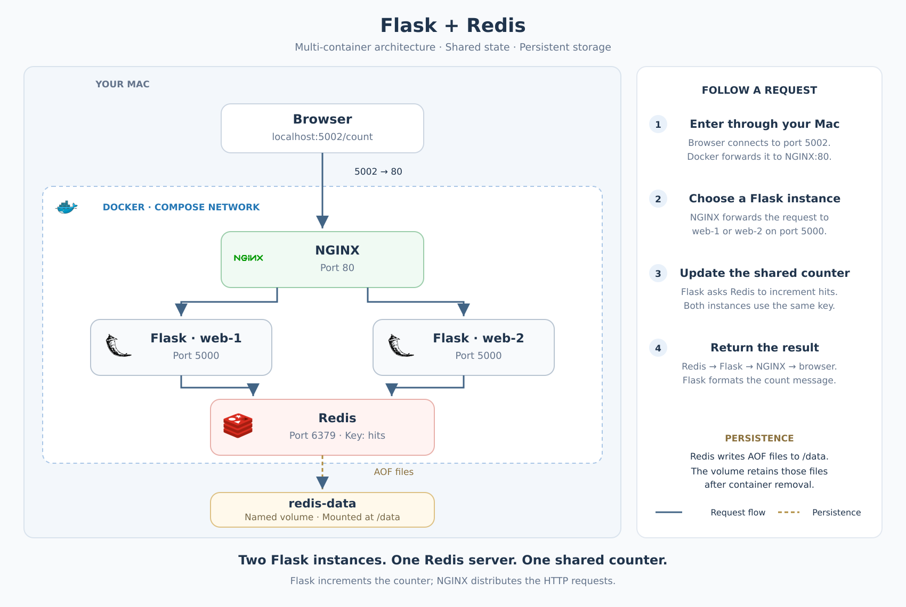

# Flask + Redis with Docker Compose and NGINX

I built a Flask application that stores a visit counter in Redis, then added persistent storage and scaled Flask to two containers behind an NGINX load balancer. The application is accessible locally at **`http://localhost:5002`**.

I started with hands-on Docker command practice but gaps in Dockerfiles, Compose, and container networking. This project helped me connect those concepts by building the application step by step, troubleshooting failures, and checking the result through browser requests and container logs.

## Features

- `/` returns a welcome message.
- `/count` increments and displays a counter stored in Redis.
- Dockerfiles define the Flask and Redis images.
- Compose manages services, networking, environment variables, and storage.
- Redis append-only file (AOF) persistence records changes in a named volume.
- NGINX forwards requests to two Flask containers sharing the same Redis counter.

## Architecture

 

### Request flow

1. The browser connects to `http://localhost:5002/count` on the host machine.
2. Docker maps host port `5002` to port `80` in the NGINX container.
3. NGINX forwards the request to a Flask instance on internal port `5000`.
4. Flask calls `INCR` on the Redis key `hits` through the Redis client library.
5. Redis atomically increments the shared counter and returns its new value.
6. Flask formats the response, which travels through NGINX to the browser.

NGINX forwards HTTP requests; Flask performs the Redis operation. Both Flask instances use the same Redis server and key, so they do not maintain separate counters. The welcome route does not access Redis.

### Services and ports

| Compose service | Responsibility | Internal port | Published host port |
| --- | --- | --- | --- |
| `loadbalancer` | Receives browser traffic and forwards it to Flask | `80` | `5002` |
| `web` | Handles routes and communicates with Redis | `5000` | None |
| `redis` | Stores the shared counter | `6379` | None |

All services join Compose's default network. Service names such as `web` and `redis` act as hostnames on that network.

Inside a container, `localhost` refers to that container itself. Flask therefore connects to `redis`, rather than `localhost`, to reach the separate Redis server.

## Project files

| Path | Purpose |
| --- | --- |
| `app.py` | Flask routes, Redis client configuration, and server startup |
| `requirements.txt` | Python dependencies: `flask` and `redis` |
| `Dockerfile` | Builds the Flask image from `python:3.13-slim` |
| `redis/Dockerfile` | Builds upon the official Redis image |
| `compose.yaml` | Defines the services and their runtime configuration |
| `nginx.conf` | Defines the Flask upstream and HTTP forwarding |
| `docs/images/architecture.png` | Architecture image embedded in this README |

The Python `redis` package is a client library. The Redis server runs separately in its own container.

## Prerequisites

- Docker Desktop installed, with its engine running.
- Docker Compose available through `docker compose`.
- Host port `5002` available.
- Internet access for the initial image pulls and dependency installation.

Python and Redis do not need to be installed directly on the host for this workflow.

## How I built the application

### 1. Package Flask and its dependencies

I created two routes in `app.py`: a welcome page and a `/count` route that calls `my_redis.incr("hits")`. The returned number is inserted into the browser message. Redis holds the counter; the Python variable holds the result for that request.

I listed `flask` and `redis` in `requirements.txt`. Flask handles web requests, while the Python Redis package provides a client for the separate Redis server.

My Flask Dockerfile selects `python:3.13-slim`, sets `/app` as the working directory, copies the dependency list, installs the packages, and then copies `app.py`. Its default startup command executes the Python file.

```dockerfile
FROM python:3.13-slim
WORKDIR /app
COPY requirements.txt .
RUN pip install -r requirements.txt
COPY app.py .
EXPOSE 5000
CMD ["python", "app.py"]
```

I initially used Python 3.8, then updated the base version before building. I also learned that `WORKDIR` selects a directory inside the image; it does not bring local files into it. That requires `COPY`.

Installing dependencies before copying the application allowed Docker to reuse the installation step when only `app.py` changed. A later rebuild showed the pip installation step as `CACHED`.

### 2. Add the Redis service and Compose configuration

I created `redis/Dockerfile` using the official Redis base image. That image already contains the server and its startup behavior, so I did not need to install Redis manually.

In Compose, `web` uses `build: .`, while `redis` uses `build: ./redis`. These are build-context paths relative to the Compose file. Each context contains its service's Dockerfile.

The services share Compose's default network. Flask connects to the hostname `redis` on port `6379`; it does not use `localhost`, which would refer to the Flask container itself.

I validated the YAML with `docker compose config`, built the images, and started the application. Before adding NGINX, the web service published `5002:5000`: host port 5002 forwarded to Flask's internal port 5000.

### 3. Verify both application routes

The welcome route displayed:

```text
Hello, World. Welcome to Flask with Redis!
```

Repeated requests to `/count` returned `25`, `26`, and `27`. This confirmed that Flask could contact Redis and increment the same stored key on each request.

### 4. Preserve the counter across container replacement

Closing a tab and opening another showed that the counter was shared, but it did not prove persistence: Redis was still running and holding its data in memory.

I enabled AOF and attached a named volume:

```yaml
command: redis-server --appendonly yes
volumes:
  - redis-data:/data
```

I also declared `redis-data` in Compose's top-level `volumes` section. Redis writes persistence files to `/data`; the volume retains those files independently of the container.

For the actual test, I recorded a count of **9**, ran `docker compose down` without deleting volumes, and recreated the services. The next request returned **10**. Redis's logs also showed it loading its append-only files.

### 5. Read connection settings from environment variables

I replaced the hardcoded connection values with environment lookups:

```python
redis_host = os.environ.get('REDIS_HOST', 'redis')
redis_port = int(os.environ.get('REDIS_PORT', 6379))
my_redis = redis.Redis(host=redis_host, port=redis_port, db=0)
```

The integer conversion matters because environment values are strings. Compose supplied the settings to the web container, and `printenv` showed `redis` and `6379` when both variables were explicitly configured.

I rebuilt the web image and recreated its container to include the changed code. The counter continued from **11 to 12**. In the final Compose file, only `REDIS_HOST` is explicit; `REDIS_PORT` uses the Python fallback.

### 6. Put two Flask instances behind NGINX

I removed the published port from `web` so replicas would not compete for the same host port. The single NGINX service now owns `5002:80` and forwards requests to Flask over the Compose network.

I mounted `nginx.conf` read-only at `/etc/nginx/conf.d/default.conf`. Its upstream points to `web:5000`, and its `location /` block forwards both the welcome and counter routes.

```nginx
upstream flask_backend {
    server web:5000;
}

server {
    listen 80;

    location / {
        proxy_pass http://flask_backend;
    }
}
```

I started the application with `docker compose up --scale web=2`. Successful `GET /count` entries appeared under both `web-1` and `web-2`, while the counter continued increasing. This verified traffic distribution across two Flask containers using a shared Redis counter.

## Challenges and fixes

### The Docker engine was not running

The first build failed because the Docker command could not connect to the engine's socket. Opening Docker Desktop and starting its engine resolved that issue. The failure occurred before Docker could process either Dockerfile.

### Compose could not find the Redis build context

I initially placed the Redis folder outside `flask-redis`, but Compose expected it at `./redis`. The build failed with `unable to prepare context`. Moving the folder into the project made the configuration match the filesystem, and both images built successfully.

### I confused copying files with installing packages

Early drafts included `RUN flask redis` and a reversed `COPY . requirements.txt`. I learned that `RUN` executes a command; it does not install package names automatically. The dependency list must be copied into the image before `pip install -r requirements.txt` can read it.

### Host port 5000 was already occupied

The initial startup failed with `bind: address already in use`. I changed the host side of the mapping to 5002 while keeping Flask on internal port 5000. My first attempt changed both sides to `5002:5002`, which did not match Flask's listener.

This clarified why Flask's logs still showed port 5000 even though the browser used port 5002. In the final architecture, that browser port forwards to NGINX on 80, and NGINX connects to Flask on 5000.

### I confused the Redis client with the server

The Python `redis` library does not start the Redis server. It lets Flask communicate with that server. I also initially used Flask's port 5000 for the Redis connection before correcting it to Redis's port 6379.

### YAML structure and volume declarations were unfamiliar

I needed to distinguish a service-level volume attachment from the top-level named-volume declaration. I also mixed environment-list syntax with mapping syntax. Repeated `docker compose config` checks helped confirm the final structure before applying changes.

### Persistence required more than revisiting the page

A count surviving browser refreshes only proved that the running Redis server held shared state. AOF plus a retained volume, followed by container removal and recreation, provided the persistence evidence.

### Scaling required a separate traffic entry point

Two Flask containers can each listen on internal port 5000, but they cannot both publish the same host port. Moving the host mapping to NGINX made it possible to run replicas. NGINX forwards HTTP requests; each Flask instance performs the Redis increment.

## Run the application

Run the following commands from the project directory containing `compose.yaml`.

### 1. Validate the configuration

```bash
docker compose config
```

This checks and displays the resolved Compose configuration. It does not build images, start services, or validate the contents of `nginx.conf`.

### 2. Build the images

```bash
docker compose build
```

Compose uses the main project folder as the Flask build context and `./redis` as the Redis build context. NGINX uses an existing image rather than a project Dockerfile.

### 3. Start two Flask instances

```bash
docker compose up --scale web=2
```

Keep the terminal open to see startup and request logs. To run in the background instead:

```bash
docker compose up -d --scale web=2
```

The replica count is selected by the startup command; it is not declared in the current Compose file.

### 4. Open the routes

| Route | URL | Expected result |
| --- | --- | --- |
| Welcome | http://localhost:5002/ | `Hello, World. Welcome to Flask with Redis!` |
| Counter | http://localhost:5002/count | A message containing the updated visit count |

Each request to `/count` increments the counter, including requests made by command-line tools.

## Configuration

### Environment variables

`app.py` reads Redis connection settings from the container environment.

| Variable | Python fallback | Current Compose configuration |
| --- | --- | --- |
| `REDIS_HOST` | `redis` | Explicitly set to `redis` |
| `REDIS_PORT` | `6379` | Omitted; the fallback is used |

The port is converted to an integer because environment values are strings. Redis database `0` remains configured directly in Python.

Check the explicitly supplied hostname:

```bash
docker compose exec --index 1 web printenv REDIS_HOST
```

`REDIS_PORT` will not appear in `printenv` when it is omitted from Compose, even though Python uses its fallback. To supply both settings explicitly, add `REDIS_PORT: "6379"` beneath the existing web `environment` section.

### Port mapping

`5002:80` means **host port 5002 → NGINX container port 80**. NGINX then connects to Flask on `web:5000` over the Compose network.

Host port `5000` was occupied during setup, so the browser entry point was changed to `5002`. Flask's internal port remained `5000`.

### Persistent storage

Redis starts with `redis-server --appendonly yes`. The mapping `redis-data:/data` mounts a Docker-managed named volume at Redis's data directory.

These settings perform different jobs:

- AOF enables Redis to record changes in files.
- The named volume retains those files independently of the container.

Closing a browser tab is not a persistence test: Redis can still retain the counter in memory while its process runs. Container removal and recreation provide a stronger test.

The NGINX mount is different: `./nginx.conf:/etc/nginx/conf.d/default.conf:ro` is a read-only **bind mount** of a local configuration file.

## Verification and results

The following results were observed during the project walkthrough.

| Test | Observed result | What it verified |
| --- | --- | --- |
| Welcome route | Welcome message displayed | Browser traffic reached Flask |
| Repeated counter requests | `25 → 26 → 27` | Redis incremented the count on each request |
| Container replacement | Recorded `9`, ran `down`, started again, then received `10` | The count survived container replacement through persisted storage |
| Environment configuration | Earlier inspection displayed `redis` and `6379` when both were explicitly configured | Compose supplied the connection settings |
| Updated Flask code | Counter increased `11 → 12` | Redis access worked after reading settings from the environment |
| Scaling and load balancing | HTTP `200` request logs appeared under both `web-1` and `web-2` | NGINX forwarded requests to both Flask instances |

The final Compose configuration now omits `REDIS_PORT` and uses the application's fallback.

### Repeat the persistence test

1. Visit `/count` and record the number, then stop refreshing.
2. Remove the containers and network while keeping the named volume:

   ```bash
   docker compose down
   ```

3. Recreate the services:

   ```bash
   docker compose up --scale web=2
   ```

4. Visit `/count` once. If the recorded number was `N`, the next result should be `N + 1`, assuming no intervening requests.

**Do not add `-v` or `--volumes` to `down` when retaining the data. Those options delete the named volume.**

### Repeat the load-balancing test

Refresh `/count` several times while watching logs. Look for successful `GET /count` entries under both Flask containers.

```bash
docker compose logs --tail=50 web loadbalancer
```

A rising count alone proves counter behavior, not request distribution. Logs from both instances provide the distribution evidence.

## Useful commands

| Command | Purpose |
| --- | --- |
| `docker compose ps` | Inspect service container status and port mappings |
| `docker compose logs --tail=50 redis` | Review Redis startup and persistence messages |
| `docker compose build web` | Rebuild only the Flask image after application changes |
| `docker compose up -d --scale web=2` | Apply configuration/image changes while keeping two Flask instances |
| `docker compose exec loadbalancer nginx -t` | Validate NGINX configuration in the running container |
| `docker compose restart loadbalancer` | Restart NGINX to resolve current Flask destinations |
| `docker compose down` | Stop and remove containers and the network while retaining the named volume |

If Flask containers are replaced or the replica count changes, restart NGINX afterward. The current upstream resolves `web` at startup and does not dynamically track every container-address change.

## Troubleshooting

| Symptom | Explanation and next check |
| --- | --- |
| Cannot connect to the Docker API/socket | Confirm Docker Desktop's engine is running; inspect `docker info` |
| Redis build context not found | Ensure `redis/Dockerfile` exists under the project folder and matches `build: ./redis` |
| Host port already in use | Check the left side of the NGINX port mapping and choose an available host port |
| Flask logs show port 5000 instead of 5002 | Expected: logs show Flask's internal port; the browser uses the host port published by NGINX |
| NGINX returns `502 Bad Gateway` | Inspect Flask status and logs, confirm `web:5000`, and restart NGINX if Flask container addresses changed |
| Redis connection fails | Check Redis readiness, service hostname, port, and web environment settings |
| Python edits are not reflected | Rebuild the web image and recreate its container; `app.py` is copied during the build |
| Counter resets | Check AOF startup messages, the `/data` volume mount, and whether the volume was deleted or a different Compose project was used |

## Design decisions

- **Separate services:** Flask handles HTTP requests; Redis stores state; NGINX handles incoming traffic and forwarding.
- **Shared Redis counter:** An atomic increment avoids lost updates when different Flask instances receive requests concurrently.
- **Internal application ports:** Only NGINX publishes a host port, avoiding conflicts between Flask replicas.
- **Named volume plus AOF:** Storage retention and Redis's saving behavior are configured separately and tested together.
- **Dependency-first build order:** Copying `requirements.txt` before `app.py` allows the dependency-installation layer to be reused when only code changes. This was visible as `CACHED` during a rebuild.
- **Official Redis base image:** The Redis Dockerfile inherits an installed server and default startup behavior rather than installing Redis manually.
- **Read-only NGINX configuration:** A bind mount keeps the forwarding rules visible in the project without allowing the container to modify them.

## Improvements and optimizations

These are proposed improvements, not features already implemented.

| Priority | Improvement | Benefit |
| --- | --- | --- |
| 1 | Add Redis and web health checks, readiness-aware dependencies, and sensible connection retries | Short-form `depends_on` controls order but does not establish application readiness |
| 1 | Use a production WSGI server for Flask and guard direct `app.run(...)` execution with `if __name__ == "__main__":` | Enables importing the application without starting the development server |
| 2 | Pin Python packages and image versions; consider image digests for reproducible releases | Reduces unexpected changes from unpinned packages and moving tags |
| 2 | Add `.dockerignore` entries for `.git`, virtual environments, caches, and unrelated local files | Reduces build context transfer and accidental inclusion of unnecessary files |
| 2 | Run the Flask process as a non-root user | Limits container process privileges |
| 2 | Configure dynamic NGINX service discovery or explicitly manage reloads after scaling | Avoids stale backend addresses after Flask containers change |
| 3 | Add Redis connection timeouts and deliberate error responses | Makes dependency failures easier to diagnose and handle |
| 3 | Add an instance identifier to logs or a diagnostic response header | Makes load-balancing verification easier |
| 3 | Add backup and restore tests for the Redis volume | Persistence is not a backup against volume deletion or host loss |
| 3 | Bind the published port to `127.0.0.1` for a host-only local demo | Restricts the browser entry point to the local machine |

This implementation is a local learning project. It currently uses Flask's development server, unauthenticated Redis on the shared network, and moving image tags. Production deployment would require additional operational configuration.

## Key lessons

- Dockerfiles build images; running containers execute the packaged application.
- `RUN` executes during the build; `CMD` defines the default container startup command.
- Build-context paths and container paths refer to different filesystems.
- `EXPOSE` documents a port; Compose port publishing creates host access.
- Service names provide container-to-container discovery on the Compose network.
- Environment variables separate runtime settings from application code.
- Multiple Flask containers can share state through one Redis server.
- AOF and a named volume work together to preserve the counter across container replacement.
- Logs distinguish a working application from verified traffic distribution.

## References

- [Docker build best practices](https://docs.docker.com/build/building/best-practices/)
- [Docker Compose startup order](https://docs.docker.com/compose/how-tos/startup-order/)
- [Flask production deployment](https://flask.palletsprojects.com/en/stable/deploying/)
- [Redis persistence](https://redis.io/docs/latest/operate/oss_and_stack/management/persistence/)
- [NGINX HTTP upstream module](https://nginx.org/en/docs/http/ngx_http_upstream_module.html)
